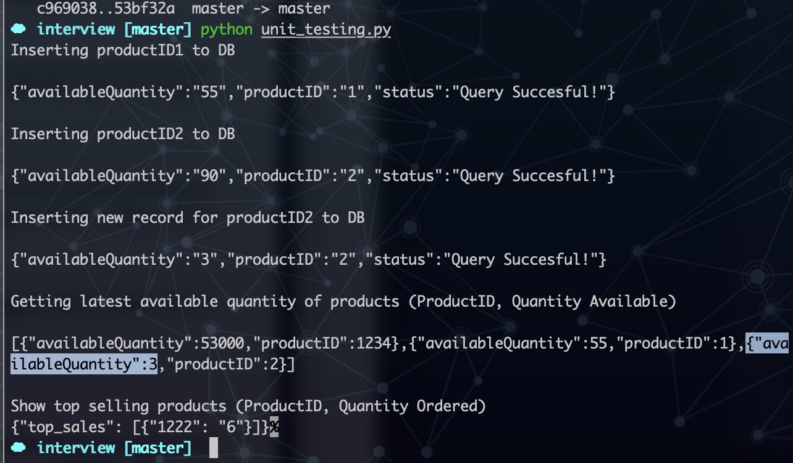

# Case Study for Inventory Management
``` bash
├── app                    # Directory to host the building of Flask container
│   ├── app.py             # Hosts the flask app API on port 5000
│   ├── Dockerfile         # Image rebuilt on public python image and adding in app.py
│   ├── requirements.txt   # Overkill, but if more packages are needed this is cleaner
│   └── ...                
├── db                     # Directory to host SQL files
│   ├── init.sql           # Ad-hoc SQL queries to get DB/Tables and dummy data inserted
│   └── ...                
│── run.sh                 # Kicks off docker compose build and deploy - Nice to have for testing
│── docker-compose.yml     # 2-Container deployment of mysql and flask app
│── united_image.png       # Screenshot for README.md of unit_testing.py
│── unit_testing.py        # Python Script to try various curl commands for POST/GET
└──
```

## Building flask application with Docker

This was my first time doing a multi-container application with Docker-Compose that communicate with eachother, generally I've been working in the kubernetes using multi-container in same pod. The setup is similar with YAML formatting but for this application you just need to run MYSQL container that I pulled from Dockerhub mysql:5.7 and custom built flask image on respective 3307/5000 ports. Docker compose has ability to build images on fly rather than using ```docker build -t flaskapp:v1 . ```

The run.sh command invokes a build and redeploy and doesn't cache so when adding additional functionality to flask app, you aren't stuck debugging for a redeployment that didn't pick up local change: ```docker-compose build && docker-compose up ```

## Docker compose networking and Volume mounts

For this application, I'm just running it local so the docker volume claim lives as long as I don't run ```docker-compose down```. For Kubernetes deployment using a storage class like AWS EFS where it uses NFS protocol, so that multiple pods can mount the same volume and use shared same space is very useful. For this application that's not needed as the Flask API is submitting queries to MySQL container. Exposing the port from containers, in this case just default but can always change client side port if there is a pre-existing application blocking it.

## API functionality

In the provided directory there is a unit_testing.py that casts curl commands using python's OS library. These strings were generated from postman and can be invoked in a lot of different ways. By default its a POST request taking in the update

* Inserting an update of product Quantity to DB

```
curl --location --request POST "localhost:5000/inventory" \
--form "availableQuantity=55" \
--form "productID=1"
```

* Updating product quantity

```
curl --location --request POST "localhost:5000/inventory" \
--form "availableQuantity=3" \
--form "productID=1"
```

* Grab latest available quantity of products
```
curl --location --request GET "localhost:5000/inventory"
```

This is a bit tricky as inventoryDB tracks all updates, but from API the application needs just latest update for each productID sorted by the auto-increment column. This can be done with date-time comparisons, but this does sthe same job :)

```SELECT m1.productId,m1.availableQuantity
FROM inventory m1 LEFT JOIN inventory m2
ON (m1.productID = m2.productID AND m1.record < m2.record)
WHERE m2.productID IS NULL;
```


* Show top selling products (GroupBY query)

```
curl --location --request GET "localhost:5000/sales"
```

Highlighted is expectation of inserting an update of availableQuantity, and see latest change when still keeping track of all updates in same table


## Next steps

This is just setting up the backend with all containerized applications running locally. A user interface to interact with to call these API GET/POST requests and some monitoring service such that it can call the /inventory API to check for criteria and either send email out or UI to show which productID are low given updates. To deploy on an external facing service like AWS:

* Spin up compute and open external facing security groups and run this same application with ip = 0.0.0.0
<!-- * Use a public     -->
